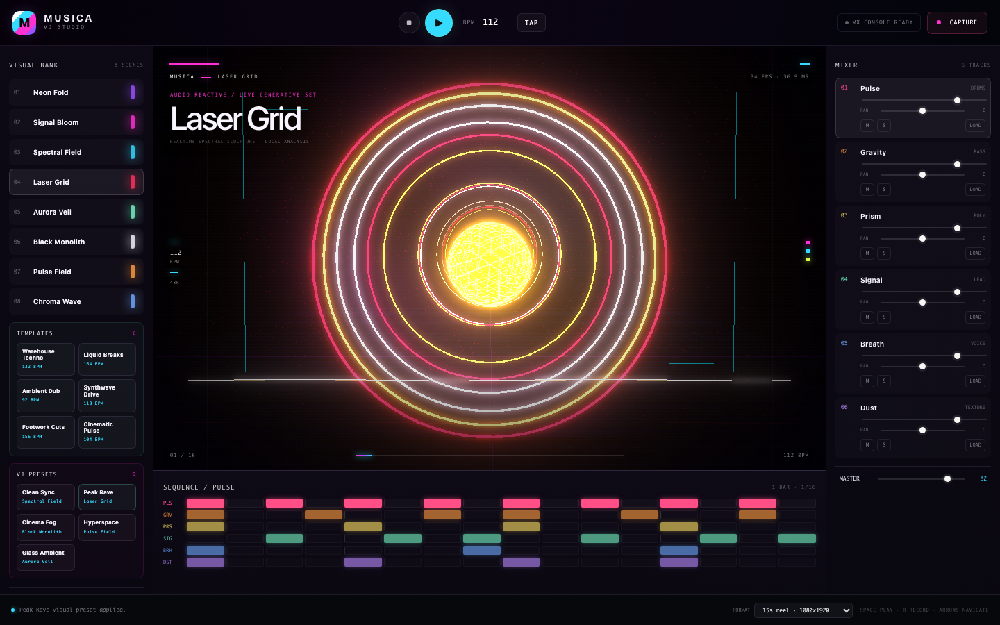

# Musica VJ Studio

[](https://github.com/ruvnet/musica/actions/workflows/musica-vj.yml)
[](src-tauri/tauri.conf.json)
[](src/visual/VisualEngine.ts)
[](src/core/agentProvider.ts)
[](src/controllers/ControlRouter.ts)



Musica VJ Studio is the flagship Musica performance surface: a live AI-directed music system and futuristic VJ instrument for desktop and web. It combines realtime synthesis, imported audio, governed creative generation, Meta-LLM set planning, MIDI and Logitech control, Three.js visuals, temporal VJ presets, social capture, and the Rust Musica DSP core.

## What is implemented

| Area | Current implementation |
|---|---|
| Agentic direction | Meta-LLM or local agent planner can choose a template, BPM, scene, prompt, visual intensity, art-direction macros, temporal controls, and arrangement notes, then apply the whole performance state |
| Music | Six independent drum, bass, chord, lead, breath, and texture tracks with volume, pan, mute, solo, step editing, prompt seeded mutation, performance templates, imported audio loops, MIDI-file import, and Lyria/Gemini generated song loading |
| Synth and effects | Layered drum voices, sub-plus-mid bass, four-voice chord pads, dual-oscillator leads, formant breath, FM/noise texture beds, swing/humanization, tempo delay, feedback, convolution reverb, per-track send levels, and bus compression |
| Timing | Web Audio sample clock with a 25 ms scheduler that maintains a 120 ms native event queue |
| Visuals | Three.js WebGL 2 tunnel, bloom, and terrain engines with eight themed visual-bank scenes, audio analysis, reflective waveform ribbon, haze, editorial telemetry, bloom, adaptive pixel ratio, and four playable art-direction macros |
| Temporal VJ | Five VJ presets plus live speed, strobe, trail, morph, camera, and phase controls for a more futuristic performance language |
| Controllers | Keyboard, F13 through F24 global shortcuts, WEBMIDI.js browser MIDI, and an official Logitech Actions SDK companion |
| Capture | 1080 by 1920 presets at 6, 9, 15, and 30 seconds plus a 1080 square preset; packaged Tauri requires an MP4 whose ISO `stsd` sample entries prove H.264/AAC, while browser development permits WebM fallback |
| Creative AI | Local prompt mutation always works; optional Rust adapters include Meta-LLM planning, Cognitum async partner calls, and disabled-by-default Lyria 3 Pro preview generation with structured prompts, explicit cost approval, private asset staging, and local audio analysis |
| Musica core | The Tauri crate depends on the root Rust library so STFT, graph separation, streaming stems, HearMusica mastering blocks, WAV I/O, and future WASM analysis can be exposed without replacing the app |
| Samples | Two checked in six second H.264 and AAC vertical fixtures generated entirely from procedural audio and visuals |

## Run the studio

Prerequisites are Node.js 24, npm, the stable Rust toolchain, Xcode Command Line Tools, and macOS 13 or later.

```sh
cd apps/musica-vj
npm ci
npm run tauri dev
```

The browser development surface is also useful for UI work:

```sh
npm run dev
```

The browser build supports synthesis, visuals, file import, keyboard control, and capture when the browser provides MediaRecorder. Native dialogs, global shortcuts, the Logitech socket, and provider commands require Tauri.

## Unsigned release artifacts

The CI release workflow can produce unsigned desktop builds for:

| Platform | Artifact family | Notes |
|---|---|---|
| macOS | `.app` archive and `.dmg` | macOS 13+ target; Apple signing, notarization, and stapling are protected release steps |
| Linux | `.deb` and AppImage | Built on Ubuntu 24.04 with WebKitGTK and Tauri system dependencies installed by CI |
| Windows | NSIS installer | Built on `windows-2025`; WebView2 runtime availability is still a target-machine prerequisite |

These artifacts are for validation and internal distribution. Public macOS release still requires the signing and notarization gates in ADR-167.

## Controls

| Input | Action |
|---|---|
| Space | Play or pause |
| R | Start or stop capture |
| T | Tap tempo |
| Enter | Trigger the selected track |
| Up and down arrows | Select the previous or next track |
| Left and right arrows | Select the previous or next visual |
| M and S | Mute or solo the selected track |
| Left and right brackets | Reduce or increase visual intensity |
| Minus and equals | Reduce or increase master level |
| MIDI notes 36 through 41 | Trigger tracks one through six |
| MIDI notes 48 through 55 | Select visual scenes one through eight |
| MIDI notes 60 through 71 | Trigger performance templates, wrapping through the template bank |
| MIDI CC 1 through 13 | Master, reactivity, tempo, visual macros, and temporal VJ controls |

The left-side Artist Macros turn Signal Bloom into a visual instrument: Sculpture changes the spectral form and frequency relief, Motion changes drift and camera movement, Atmosphere changes particles and haze, and Ribbon changes the foreground waveform gesture. Every macro is continuously playable from 0 to 100%, clamped in the visual engine, applied to preallocated geometry without rebuilding the scene, and exposed as an assignable Logitech dial action. Reactivity remains the master audio-response amount, so an artist can separately control how strongly the music speaks and what visual language it speaks through.

The visual bank includes Neon Fold, Signal Bloom, Spectral Field, Laser Grid, Aurora Veil, Black Monolith, Pulse Field, and Chroma Wave. VJ presets such as Peak Rave, Cinema Fog, Hyperspace, and Glass Ambient apply scene, intensity, macro, and temporal settings without changing the music. Temporal controls shape realtime animation speed, strobe gating, trail persistence, geometry morph depth, camera movement, and phase offset.

Performance templates apply both sound and visuals: Warehouse Techno, Liquid Breaks, Ambient Dub, Synthwave Drive, Footwork Cuts, and Cinematic Pulse. Each template updates BPM, every track pattern, pitch material, mix position, the active scene, reactivity, visual macros, and optional temporal controls.

MIDI support uses open-source building blocks where they are strongest: WEBMIDI.js handles live browser controller input, while `@tonejs/midi` parses `.mid` and `.midi` files into editable Musica track templates. Loading a MIDI file through any track's Load button maps percussion, bass, chords, lead, breath, and texture material into the six-track sequencer and applies the first MIDI tempo when available. Audio files still load as clips on the selected track.

F13 through F24 provide the app specific Options+ fallback. The exact mapping is in [`logitech/options-plus-fallback.json`](logitech/options-plus-fallback.json).

## Logitech MX Creative Console

The devices in the reference setup are the Logitech MX Creative Console Keypad and Dialpad. The production integration uses Logitech's official C# Actions SDK instead of undocumented raw HID access. This preserves Options+ ownership, LCD labels, Marketplace packaging, and device compatibility.

The companion is under [`logitech`](logitech). Build it on a Mac that has current Logitech Options+ and .NET 8:

```sh
dotnet test logitech/tests/MusicaVj.Logitech.Core.Tests/MusicaVj.Logitech.Core.Tests.csproj
dotnet build logitech/src/MusicaVj.Logitech.Plugin/MusicaVj.Logitech.Plugin.csproj -c Debug
```

Run Musica VJ once before loading the plugin. The app creates a random controller token with mode `0600` under its application support directory. The plugin sends strict, replay checked messages over a per user Unix socket. It performs no file or socket work in the hardware callback.

See [`logitech/README.md`](logitech/README.md) for packaging and physical device validation.

## Optional creative provider

Creative generation is off by default. Local synthesis and prompt mutation never require a network connection. To enable the built in asynchronous provider contract for an authorized Cognitum deployment, launch the Tauri process with:

```sh
MUSICA_CREATIVE_ENABLED=true \
MUSICA_CREATIVE_PROVIDER=async_partner \
MUSICA_CREATIVE_API_BASE=https://api.cognitum.one \
MUSICA_CREATIVE_API_TOKEN=replace_with_an_authorized_token \
MUSICA_CREATIVE_MODEL=replace_with_a_supported_model \
npm run tauri dev
```

The fixed contract uses `POST /v1/music/generations` and `GET /v1/music/generations/{taskId}`. The Rust client requires HTTPS, rejects redirects and proxies, limits concurrency and response size, and pins both metadata and audio URLs to build approved hosts. Generated audio is downloaded by a bounded Rust command, requires an `audio/*` response type plus a supported file signature, and is returned as raw IPC bytes. A generic MIME such as `application/octet-stream` is rejected even when the bytes resemble audio. Signed output URLs are never written to local storage.

`suno_partner` is intentionally unavailable in a standard build. It can only be enabled in a partner build that embeds a documented official host at compile time with `MUSICA_CREATIVE_ALLOWED_HOSTS`. Consumer cookies, scraping, browser automation, and unofficial wrappers are not supported.

A runtime environment variable cannot widen the compiled provider allowlist. The webview content security policy has no external network origin because provider traffic and generated audio downloads stay in Rust.

### Google Lyria 3 Pro preview

Lyria is a separate provider adapter for complete songs. It is optional, paid, and disabled unless all required settings are present in the Tauri process environment:

```sh
MUSICA_CREATIVE_ENABLED=true \
MUSICA_CREATIVE_PROVIDER=lyria_3_pro \
GEMINI_API_KEY=replace_with_your_google_api_key \
MUSICA_CREATIVE_MAX_GENERATION_USD=0.32 \
MUSICA_CREATIVE_REQUEST_TIMEOUT_SECONDS=600 \
MUSICA_CREATIVE_RETAIN_PROMPTS=false \
MUSICA_CREATIVE_TERMS_VERSION=reviewed_2026_07_18 \
npm run tauri dev
```

| Setting | Meaning |
|---|---|
| `MUSICA_CREATIVE_ENABLED` | Must be `true`; leave unset to guarantee provider-disabled behavior |
| `MUSICA_CREATIVE_PROVIDER` | Must be `lyria_3_pro` for this adapter |
| `GEMINI_API_KEY` | Required Rust-only credential; never passed to React or persisted in project data |
| `MUSICA_CREATIVE_MAX_GENERATION_USD` | Cumulative reserved-plus-recorded generation ceiling for the running process; defaults to USD 0.32 |
| `MUSICA_CREATIVE_REQUEST_TIMEOUT_SECONDS` | Lyria request deadline; defaults to 600 seconds and must be between 60 and 900 seconds |
| `MUSICA_CREATIVE_RETAIN_PROMPTS` | Set to `false` or `0` to retain only the prompt hash in the private receipt; defaults to retaining the compiled prompt |
| `MUSICA_CREATIVE_TERMS_VERSION` | Optional operator-supplied identifier for the terms review recorded with the receipt |

The model and endpoint are fixed in the adapter as `lyria-3-pro-preview` and the Gemini Interactions endpoint. Runtime configuration cannot redirect the API key to another host. Provider status is a static configuration check, not a live probe that proves the preview model is currently available to the account or region. Requests send `store: false`, require both the React budget checkbox and a native Rust-owned warning dialog, and reserve the current documented USD 0.08 published price for one candidate and one attempt. The native dialog shows duration, format, mode, maximum charge, and a request fingerprint before Rust may dispatch. The adapter calls `reqwest` with retries disabled and its task ledger permits at most one provider `POST`; Musica does not automatically retry rate limits, server failures, or ambiguous transport results because Google does not document create idempotency for Lyria. A connection failure after dispatch may still have incurred the USD 0.08 charge and is reported as ambiguous.

The credential is consumed only by Rust application code, but an operator who launches `npm run tauri dev` with `GEMINI_API_KEY` in the shell also gives that environment variable to development child processes, including the Vite process. Vite does not bundle a non-`VITE_` variable, and the production secret scan checks this boundary, but development process inheritance is not equivalent to Keychain isolation. Use a dedicated low-quota test key and do not run untrusted development tooling in that environment.

Use the generation panel to describe the complete track, set 31 to 180 seconds and 60 to 200 BPM, choose instrumental or vocal output, add optional lyrics and timed sections, choose MP3 or WAV, affirm rights for supplied lyrics, and approve the displayed cost. Submission creates a local asynchronous task. Cancellation before provider dispatch releases the reservation. Cancellation after dispatch leaves the task in `processing`, marks cancellation requested, and keeps polling because Google exposes no cancellation operation; a late valid result is retained and is not auto-loaded. On completion, the selected track receives the generated song as one-shot audio, and Musica measures its encoded metadata and decoded waveform, BS.1770-style integrated loudness, BPM, beat grid, onset map, spectral profile, confidence-gated musical key, probable sections, and recommended visual scene. Analysis selects a dominant-energy channel for waveform, beat, key, and spectrum so anti-phase stereo does not cancel; loudness K-weights and gates each channel before summing energy. Bass drives camera displacement, detected beats drive radial pulse, high-frequency energy controls particle count, and measured section boundaries switch terrain, bloom, or tunnel scenes during playback. Provider text is preserved as lyrics or structure when returned but is never used as measured audio metadata.

Each completed task is staged beneath the Tauri application-data `generated/<task-id>` directory as create-new private files: the original MP3 or WAV, the exact provider response, and `receipt.json`. A dispatched failure attempts and finishes immutable `failure-receipt.json` storage before the task becomes visibly terminal; a successful receipt stores the typed failure, validated Google request ID when available, dispatch state, cancellation state, and whether the USD 0.08 reservation was released or conservatively recorded as potentially charged. The successful generation receipt includes content hashes, requested and measured media fields, the fixed-price basis, provider request ID, prompt or prompt hash, rights declaration, and provenance expectations. The mutable frontend convenience index stores summarized analysis rather than waveform, onset, or beat arrays and is capped at 500 entries and 2 MiB. Google documents SynthID watermarking and C2PA support; Musica currently records both as expected but does not detect SynthID or cryptographically validate C2PA. The receipts are workflow evidence, not a copyright or licensing guarantee.

`MUSICA_CREATIVE_RETAIN_PROMPTS=false` suppresses plaintext prompt storage in `receipt.json`; it does not redact `provider-response.json`. The exact raw provider response may contain generated lyrics, structural text, safety details, or content that overlaps confidential input. The generated directory therefore remains sensitive private application data and needs an explicit retention and deletion policy before broad distribution.

Current Lyria V1 limits are intentional:

- text, instrumental mode, user lyrics, timestamps, MP3, and WAV are supported;
- output is inspected rather than assumed to be 44.1 or 48 kHz;
- English, German, Spanish, French, Hindi, Japanese, Korean, and Portuguese vocal requests are accepted;
- image conditioning and multiple reference images are deferred;
- PDF conditioning is an experimental Vertex capability and is rejected by this Gemini adapter;
- Lyria 3 Clip and Lyria RealTime are modeled routing choices but unavailable;
- the job registry, cost reservation, and request deduplication do not survive app restart;
- successful asset-bundle files are immutable but not committed as one filesystem transaction, so a late disk failure can leave private partial files for manual cleanup;
- Web Audio decoding is not isolated in a constrained native media process;
- successful response JSON is capped at 96 MiB and decoded audio at 72 MiB; audio longer than 184 seconds is rejected;
- an output shorter than `max(75% of requested duration, 30 seconds)` is retained with an internal UI warning rather than rejected;
- persisted 48 kHz PCM normalization is not implemented;
- real paid generation, billing reconciliation, C2PA validation, physical-Mac 60 FPS and MP4 drift checks, physical Logitech tests, signing, and notarization are manual or protected-release gates.

The pull-request test suite uses synthetic media and no Google credential. It exercises the one-attempt ledger, but does not yet use a mock HTTP transport to count real outbound `POST` calls. To run the paid acceptance gate, use an isolated Google project with a hard account quota. One MP3 plus one WAV in the same process requires a ceiling of at least USD 0.16; alternatively restart between candidates with a USD 0.08 ceiling. Approve each native dialog separately, retain both Musica receipts and Google request identifiers, and reconcile the provider account before another attempt.

### Meta-LLM agent director

The Agent Director can turn a natural-language goal into a complete performance state. In browser preview it uses a deterministic local planner over the shipped templates. In Tauri it can call Cognitum's Meta-LLM API from Rust only:

```sh
MUSICA_META_LLM_ENABLED=true \
MUSICA_META_LLM_API_BASE=https://api.cognitum.one \
MUSICA_META_LLM_API_TOKEN=replace_with_a_cog_token \
MUSICA_META_LLM_MODEL=meta-llm \
npm run tauri dev
```

The token is read only by the Tauri process, the host is pinned to `api.cognitum.one`, redirects and proxies are disabled, responses are bounded, and the frontend receives only a typed plan. A plan may choose a performance template, visual scene, BPM, reactivity, art-direction macros, temporal controls, prompt text, and arrangement notes. The token must not be stored in `.env`, screenshots, shell history, or project files.

## Social capture

Choose a social preset and press Capture. The recorder joins `canvas.captureStream()` with the Web Audio capture destination and probes the webview for codecs in this order:

1. MP4 with H.264 and AAC
2. MP4 selected by the webview
3. WebM with VP9 and Opus
4. WebM with VP8 and Opus

The packaged Tauri app fails closed when the Mac webview cannot offer MP4. Capture enters a synchronous `starting` state before waiting for its first animation frame, so rapid commands cannot create two recorders, and stop has a 15-second finalization timeout. After capture it parses the completed ISO hierarchy and requires `avc1` or `avc3` and `mp4a` entries inside an `stsd` sample-description box before enabling save; matching text in an unrelated box is rejected. Browser development may use the WebM fallback, and its saved extension follows the actual MIME type. This is still shallow structural inspection, not a full media decode: actual encoded dimensions, delivered frames, timestamp continuity, and A/V drift remain unverified. Live recording is real time and capability dependent, not bit deterministic. The checked in sample videos are small FFmpeg generated contract fixtures and do not replace a physical packaged-Mac decode, dimension, frame-rate, and drift test on the oldest and current supported macOS versions.

Regenerate and verify the fixtures with a local FFmpeg installation:

```sh
npm run render:samples
npm run verify:samples
```

## Verification

```sh
npm run typecheck
npm run test:run
npm run verify:assets
npm run build
npm run verify:no-secrets
npm run verify:samples
```

The pull request workflow is configured to repeat those checks, compile and test the Rust workspace on macOS, run the portable Logitech transport tests, apply Clippy with warnings denied, and build an unsigned `.app` artifact. Treat that coverage as pending until the referenced workflow run is green. Signing and notarization remain protected release operations.

## Architecture records

ADRs 160 through 169 in [`../../docs/adr`](../../docs/adr) cover the Tauri boundary, audio clock, Logitech integration, Three.js renderer, creative provider governance, social capture, threat model, release gates, the Lyria capability contract, and paid-job provenance. The implementation status and evidence matrix are in [`../../docs/specs/musica-lyria-3-pro-integration.md`](../../docs/specs/musica-lyria-3-pro-integration.md).

The most important release failure mode is a WKWebView or hardware specific timing regression that unit tests cannot reproduce. The reference acceptance run is six active tracks plus recording and scene switching for ten minutes on an Apple M1 with no audible dropout, controller event latency below 35 ms at p95, visual frame time below 20 ms at p95, and a decodable 15 second 1080 by 1920 output whose audio and video drift is no greater than 20 ms.
