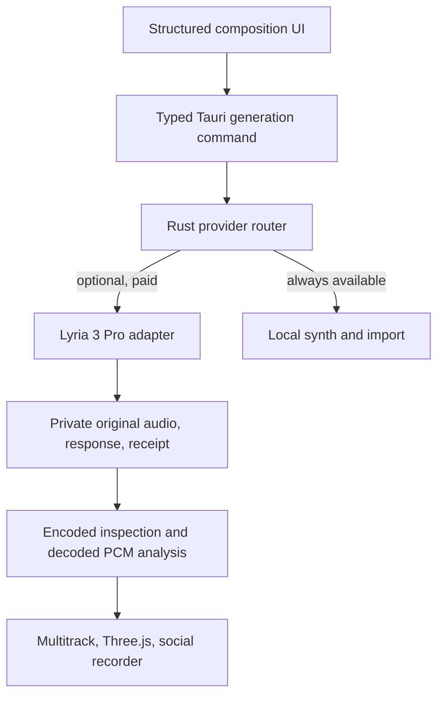

# Musica Lyria 3 Pro Integration

## Purpose and release posture

Musica integrates Google's `lyria-3-pro-preview` as an optional provider for complete songs and visualization-ready source audio. The adapter is a preview capability, is disabled by default, and never changes the offline contract: local synthesis, imported audio, multitrack performance, Three.js visualization, Logitech and keyboard controls, recording, and export remain usable without Google credentials or network access.

This document records implementation scope and evidence as of 2026-07-18. A source implementation or synthetic fixture is not evidence that Google's preview service, a physical Mac, Logitech hardware, billing, or Apple distribution currently works. Those claims have separate gates below.

## Implemented system boundary



The provider endpoint, credential, response validation, paid-job lifecycle, and private files live in Rust. React receives typed status and validated audio bytes. Google is never called from the webview.

## V1 requirement status

| Requirement | Status | Evidence or boundary |
|---|---|---|
| Text to full song | Implemented, paid proof manual | Structured compiler in `src/core/composition.ts`; fixed Interactions adapter in `src-tauri/src/lyria_provider.rs` |
| Instrumental mode | Implemented | The frontend compiler emits one provider-ready no-vocal constraint; Rust independently validates the typed instrumental and rights fields without appending duplicate prompt content |
| User-supplied lyrics | Implemented | Typed request, 12,000-character cap, and mandatory rights declaration for non-empty lyrics |
| Duration instructions | Implemented | UI contract 31 to 180 seconds; provider hard ceiling 184 seconds |
| Structural timestamps | Implemented | Up to 32 named, strictly increasing sections inside requested duration |
| MP3 response | Implemented, real response manual | Default response; MIME, signature, frame, rate, channel, and duration inspection |
| WAV response | Implemented, real response manual | Documented `response_format: {"type":"audio"}` request and RIFF/WAVE inspection |
| Original asset storage | Implemented | Private create-new audio, exact provider JSON, and receipt with separate SHA-256 hashes |
| Audio validation | Implemented with a residual decoder gap | Rust validates encoded media; Web Audio performs decode and is not an isolated process |
| Beat and section analysis | Implemented | Phase-safe dominant-channel analysis, BS.1770-style loudness, BPM, grid, onsets, spectrum, confidence-gated key, and probable sections |
| Three.js visualization project generation | Implemented as scene recommendation and live mapping | Bass drives camera displacement, beats drive radial pulse, high energy changes particles, and measured sections select terrain/bloom/tunnel; a durable project-file generator is not implemented |
| Provider cost receipts | Partially implemented | USD 0.08 published price and pricing version are recorded; provider invoice reconciliation is manual |
| Retry and cancellation | Implemented with conservative semantics | Native Rust cost dialog, one paid-dispatch ledger transition, `reqwest` retries disabled; queued cancellation releases, while post-dispatch cancellation remains processing and polling continues |
| Vertical MP4 export | Implemented shallow fail-closed container/codec gate; physical media gate remains | Packaged Tauri requires MP4 and validates H.264/AAC `stsd` sample entries before save; a physical decode must still prove actual 1080 by 1920 dimensions, frame delivery, and A/V drift |

## Deferred and experimental scope

| Item | Decision |
|---|---|
| Image conditioning and up to ten references | V2. Reject before dispatch until scoped asset access, MIME/signature validation, hashing, upload limits, and capability detection exist |
| PDF conditioning | Experimental Vertex-only investigation. Not assumed to work through this Gemini Interactions adapter |
| Lyria 3 Clip candidates | V2. Route is modeled but unavailable |
| Lyria RealTime | Experimental V2. Requires a persistent WebSocket, disconnect handling, steering, and session-cost controls |
| Lyria plus Veo alignment | V2 research |
| Automatic provider comparison | V2 after normalized quality and spend evidence exists |
| Musical key detection | Implemented locally with bounded chroma analysis; ambiguous or non-tonal audio returns null rather than using prompt metadata |
| Persisted 48 kHz float PCM normalization | Deferred; Web Audio exposes float working buffers, but V1 archives provider bytes and records the actual rate |
| Standalone WAV, FLAC, AAC, and MP3 conversion/export | Deferred beyond original MP3/WAV retention; the packaged social recorder requires H.264/AAC MP4 while browser development can negotiate WebM |
| Detected output language | Deferred; requested language is stored independently and output language must remain unknown until measured |
| Constrained media decode subprocess | Deferred security requirement; encoded validation in Rust reduces but does not remove WKWebView decoder risk |
| C2PA validation and SynthID detection | Deferred. V1 preserves source material and records expected, not verified, status |
| Restart-safe jobs, deduplication, and transactional budget ledger | Deferred. V1 state is process-local |
| Transactional multi-file asset commit and cleanup | Deferred. Files are private and create-new, but a late disk failure can leave a partial task directory |
| Deterministic native 1080 by 1920 MP4 | Deferred. V1 live recording is real-time and codec-capability dependent |
| Physical Logitech qualification | Manual release gate using the actual MX Creative Keypad and Dialpad |
| Signed and notarized macOS release | Protected release gate; unsigned pull-request artifacts are not distributable releases |

## Cost and failure contract

The documented V1 unit cost is USD 0.08 for one Lyria 3 Pro song. Cost uses integer microdollars and is accepted only when:

```text
candidate_count = 1
max_attempts = 1
request_budget >= USD 0.08
request_budget <= installation ceiling
cumulative process reservations and recorded charges <= installation ceiling
```

The native Rust dialog must approve the exact fingerprinted request after the frontend acknowledgement. The ledger permits one paid dispatch and `reqwest` retries are disabled; a transport-level POST-count test is still open. The request timeout defaults to 600 seconds and its environment override is limited to 60 through 900 seconds. The adapter does not automatically retry authentication failures, model retirement, quota, rate limits, safety rejection, server errors, invalid media, or ambiguous network failures. A technically complete but unwanted song is a new paid candidate. On an ambiguous response, Musica conservatively records a possible USD 0.08 charge and requires a new explicit budget to submit again.

The receipt's `generationCostMicroUsd` is the versioned published-price basis. It is not an exact invoice while `providerBillingVerified=false`. Acceptance criterion 8 is not complete until the request is reconciled against Google account billing.

## Reliability coverage

| Condition | V1 behavior |
|---|---|
| Authentication failure | Typed `authentication_failed`; no raw provider body crosses IPC |
| Preview unavailable or retired | HTTP 404/410 becomes `model_unavailable`; model mismatch fails response validation |
| Quota or rate limit | Typed `quota_exhausted` or `rate_limited`; no automatic paid retry |
| Safety rejection | Typed `safety_rejected` when the provider status identifies safety or blocking |
| Empty audio, invalid Base64, invalid MP3/WAV, or MIME mismatch | Fails closed before staging or Web Audio decode |
| Missing lyrics or structural text | Audio can complete; absent optional text remains absent |
| Sample-rate mismatch | Actual encoded and decoded rate is reported; no 48 kHz assumption |
| Network interruption | Typed ambiguous outcome after dispatch and conservatively recorded possible charge; never retried automatically |
| Duplicate UI submission | Same `clientRequestId` resolves to one task in the running process |
| Output shorter than requested | A valid result below `max(75% of requested duration, 30 seconds)` is retained and shown with an internal UI warning |
| Output beyond project limit | Actual duration above 184 seconds is rejected before frontend decode |
| App restart during generation | Not recovered in V1; task registry and deduplication are process-local |

User-visible cancellation is local after provider dispatch and cannot guarantee avoided work or avoided cost. The task stays `processing`, polling continues, and a late valid asset is retained without auto-loading. A completed but aesthetically poor result is never treated as a transient error.

## Provenance contract

For a successful task, the Rust receipt records:

- local and provider request identifiers;
- provider, model, pricing version, optional reviewed terms version, and UTC timestamp;
- prompt hash and, when configured, the compiled prompt;
- original audio and raw-response hashes;
- requested duration, language, format, and measured encoded audio properties;
- user rights declaration and input-asset hashes;
- reserved and recorded fixed-price cost;
- `synthidExpected=true` and `c2paExpected=true`;
- `c2paStatus=preserved_unverified` and `providerBillingVerified=false`.

A dispatched failure completes its immutable `failure-receipt.json` storage attempt before publishing terminal state. A successfully stored receipt includes the typed code, validated Google request ID when available, dispatch and cancellation state, reservation, optional conservative charge, and pricing basis; a storage failure is exposed in the terminal error suffix. Authentication, model-unavailable, quota, rate-limit, and safety failures release cost; service, malformed response, unsupported/oversized media, storage, and ambiguous post-dispatch failures conservatively record a possible charge. Raw provider error bodies are not retained. The frontend writes a mutable terminal summary for success, failure, or cancellation, drops waveform/onset/beat arrays in favor of counts, and enforces 500-entry and 2 MiB bounds.

Requested language and any provider-returned textual output remain distinct from measured media data. Output-language detection is not implemented and must not be fabricated. The receipt does not guarantee copyrightability, non-infringement, commercial clearance, SynthID detection, or C2PA validity.

## Security and privacy gates

1. `GEMINI_API_KEY` exists only in the Tauri process environment and Rust memory.
2. The API host is compiled as `generativelanguage.googleapis.com`; redirects, proxies, runtime host expansion, and webview provider networking are disabled.
3. The adapter sends `store: false`.
4. Set `MUSICA_CREATIVE_RETAIN_PROMPTS=false` for confidential lyrics or prompts; the hash remains in the receipt.
5. Successful JSON is capped at 96 MiB and decoded Lyria audio at 72 MiB before frontend decode.
6. Provider errors cross IPC only as typed codes, without raw headers, response bodies, or credentials.
7. A production bundle scan and a credentialed runtime log scan must contain no test key before promotion.
8. The remaining hostile-decoder gap blocks a claim that generated media is decoded in a constrained process.
9. Prompt retention off does not redact the exact successful `provider-response.json`; treat the generated task directory as sensitive. In development, a shell-supplied key is inherited by child build processes even though non-`VITE_` variables are not bundled.
10. Provider status is a static configuration check, not proof that the preview model is live for the account, region, or quota.

## Performance targets and evidence class

| Target | Evidence required |
|---|---|
| UI acknowledgement under 100 ms | Automated UI timing fixture plus physical-Mac confirmation |
| Upload/progress update every 250 ms | Not applicable to text-only V1 upload; future asset upload must implement this before image/PDF promotion |
| Analysis under 5 seconds | Automated test analyzes a generated 180-second, 48 kHz stereo PCM asset under five seconds on the CI runner; physical reference-Mac confirmation remains required for a real decoded song |
| Waveform under 2 seconds | Physical reference-Mac measurement |
| Visualization scene under 3 seconds | Physical reference-Mac measurement |
| Playback start under 500 ms after decode | Physical reference-Mac measurement |
| Three.js at 60 FPS | Ten-minute physical reference-Mac frame-time trace |
| External generation latency | Credentialed integration telemetry recorded without prompt, key, or response body |

No Google latency service-level objective is assumed for the preview model.

## Acceptance criteria and evidence matrix

| # | Acceptance criterion | Automated evidence | Manual or protected evidence | Current disposition |
|---:|---|---|---|---|
| 1 | Generate a 120 to 180 second song through `lyria-3-pro-preview` | Request, model, duration, and response-parser fixtures | Paid request in an isolated Google project; retain provider request ID and receipt | Manual paid gate, not proven by CI |
| 2 | Save original provider audio and decode it | Private create-new storage and synthetic MP3/WAV inspection tests | Confirm exact response/audio hashes, then decode the real asset in Musica | Implemented path; real-provider proof manual |
| 3 | Report actual duration, channels, codec, and sample rate | WAV and MP3 fixtures inspect encoded bytes; decoded PCM reports actual rate/channels | Compare Musica receipt with `ffprobe` or another independent inspector on real MP3 and WAV | Automated fixtures plus manual real-media gate |
| 4 | Recover lyrics and structural output when returned | Parser fixture preserves and classifies output text blocks | Generate a vocal/structured song and compare returned text with the private raw response | Automated parser; provider behavior manual |
| 5 | Detect BPM within two BPM of a manually verified reference | Synthetic 120 BPM test requires error no greater than two BPM; a separate 180-second stereo fixture enforces the five-second analysis budget | Verify a real generated song with a trusted DAW or beat-analysis reference | Automated accuracy and CI-speed thresholds met for fixtures; real song manual |
| 6 | Produce synchronized Three.js visualization at 60 FPS | Scene mapping invariants and visual-engine units | Reference-Mac frame trace during full-song playback, 60 FPS target, no audio discontinuity | Physical-Mac gate open |
| 7 | Export synchronized 1080 by 1920 MP4 | Recorder units require MP4 preference, reject codec text outside `stsd`, synchronously lock startup, and enforce a 15-second finalization timeout; CI samples prove only 360 by 640 H.264/AAC fixtures | In packaged Tauri, reject a WebM-only WKWebView; record and independently decode 1080 by 1920, then verify actual dimensions, frame rate, audio/video tracks, duration, and drift | Shallow container/codec gate implemented; physical synchronization gate open; deterministic MP4 deferred |
| 8 | Record exact generation charge and provenance | Receipt verifies USD 0.08 published price, hashes, request/model/time, expected watermark/provenance status | Reconcile the request against Google account billing and validate any C2PA manifest | Partial: published price recorded, exact billing and C2PA validation open |
| 9 | Keep Gemini key out of frontend bundle and logs | Production bundle secret scan and Rust-only command boundary | Run one credentialed generation with a unique canary key and scan application logs, receipts, exports, and crash artifacts | Automated plus credentialed security gate |
| 10 | Disable Lyria while local performance, visualization, recording, and export still work | Provider-disabled status and local engine/recorder tests | Thirty-minute no-network performance and capture run, including Logitech fallback | Implemented architecture; no-network soak manual |

## Credentialed acceptance run

Use a disposable or isolated Google project with account-side spend limits. Never place the key in a shell history transcript, frontend environment file, repository secret, pull-request workflow, screenshot, or test fixture.

1. Run all secret-free TypeScript, Rust, bundle, sample, and companion checks.
2. Configure at least a USD 0.16 process ceiling for one MP3 plus one WAV in the same run. Alternatively restart between separately approved requests with a USD 0.08 ceiling. Retain prompt text only when the test lyrics are non-confidential.
3. Submit one 120 to 180 second MP3 request and, under a separate explicit budget, one WAV request.
4. Record local task ID, provider request ID, response and audio hashes, receipt, provider-side billing evidence, start time, response time, and failure code if any.
5. Independently inspect both files, compare encoded and decoded duration/rate/channels, and verify BPM against a DAW reference.
6. On the reference Mac, load the song as one-shot audio, run the Three.js scene, measure analysis/playback/frame targets, and capture the 1080 by 1920 social preset.
7. Confirm the packaged app rejects a WebM-only recorder and refuses an MP4 without H.264 and AAC `stsd` entries. Independently decode the accepted export and verify audio and video tracks, actual dimensions, delivered frame rate, duration, codec, and drift. A browser WebM fallback does not satisfy the MP4 criterion.
8. Scan the production bundle, process logs, receipts, saved media metadata, crash artifacts, and exported project data for the canary key.
9. Mark criteria 1 through 10 with artifact identifiers. Do not promote the provider if any required artifact is missing.

## Release gates outside this integration

- Physical MX Creative Console hardware and Options+ compatibility remain manual.
- The current macOS CI artifact is unsigned and unnotarized.
- Public distribution requires Developer ID signing, hardened runtime, Apple notarization, stapling, Gatekeeper validation, checksums, SBOMs, and a clean-Mac install.
- The checked-in sample videos are deterministic synthetic previews, not Lyria output, Three.js captures, 1080 by 1920 exports, or social-platform acceptance evidence.

## References

- [Google AI for Developers: Generate music with Lyria 3](https://ai.google.dev/gemini-api/docs/music-generation)
- [Google AI for Developers: Interactions API](https://ai.google.dev/gemini-api/docs/interactions-overview)
- [Google AI for Developers: Lyria 3 Pro Preview model](https://ai.google.dev/gemini-api/docs/models/lyria-3-pro-preview)
- [Google AI for Developers: Gemini API pricing](https://ai.google.dev/gemini-api/docs/pricing)
- [Google Cloud: Lyria 3 and Lyria 3 Pro on Vertex AI](https://cloud.google.com/blog/products/ai-machine-learning/lyria-3-and-lyria-3-pro-on-vertex-ai)
- [Google Cloud: Prompting guide for Lyria 3 Pro](https://cloud.google.com/blog/products/ai-machine-learning/ultimate-prompting-guide-for-lyria-3-pro)
- [Google DeepMind: Lyria 3 model card](https://deepmind.google/models/model-cards/lyria-3/)
- [Google AI for Developers: Lyria RealTime](https://ai.google.dev/gemini-api/docs/realtime-music-generation)
- [ADR-164](../adr/ADR-164-governed-creative-ai-provider-boundary.md)
- [ADR-165](../adr/ADR-165-live-social-capture-and-deterministic-export.md)
- [ADR-166](../adr/ADR-166-desktop-threat-model-and-security-boundaries.md)
- [ADR-167](../adr/ADR-167-quality-performance-and-macos-release-gates.md)
- [ADR-168](../adr/ADR-168-lyria-3-pro-provider-routing-and-prompt-contract.md)
- [ADR-169](../adr/ADR-169-lyria-paid-job-assets-analysis-and-provenance.md)
